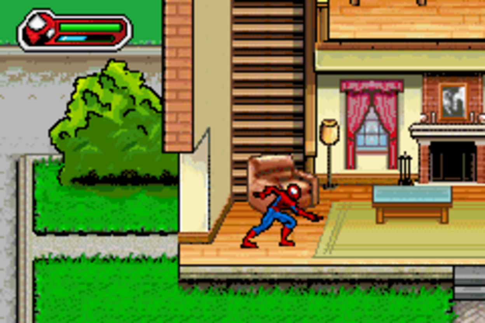
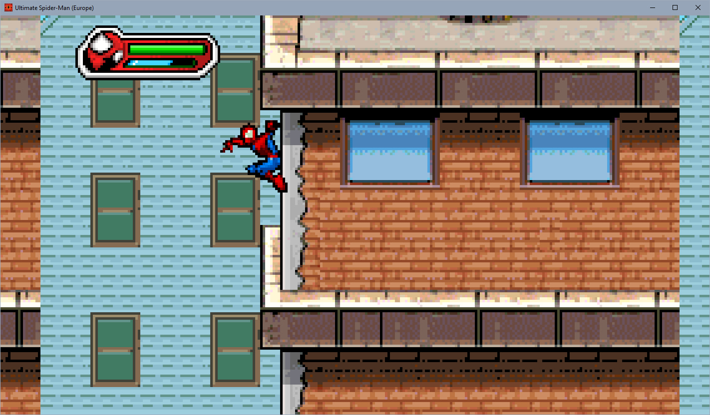

# UltimateSpiderManRecomp 
Static recompilation of Ultimate Spider‑Man (Game Boy Advance) for the native PC version (ported to consoles is planned in the future), built on the [`gbarecomp`](https://github.com/mstan/gbarecomp) framework.

## Progress
| Name                   | State   | Info                                         |
| ---------------------- | ------- | -------------------------------------------- |
| WideScreen                | Works    | the current wide mode reads beyond the boundary of the 24‑tile BG ring, so repeated/truncated parts of the level appear on the sides.|

| OG GBA | Recomp |
|---|---|
|  |  |

| Name                   | State   | Info                                         |
| ---------------------- | ------- | -------------------------------------------- |
| Options in Main Menu                | is in progress    | I would like to add an option selection button directly to the main menu, without any launchers. To do this, I have already extracted the game’s assembly code.|
| PSV,3DS,Switch and etc. Ports               | In future    | I’d like to figure out the PC first. |
